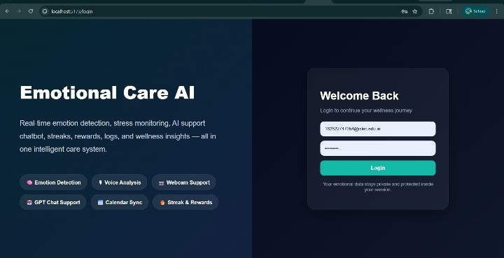
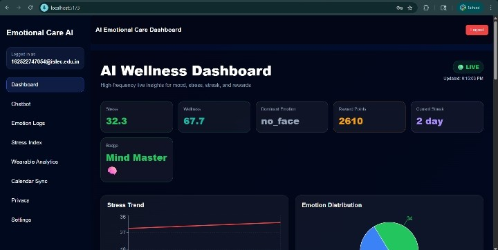
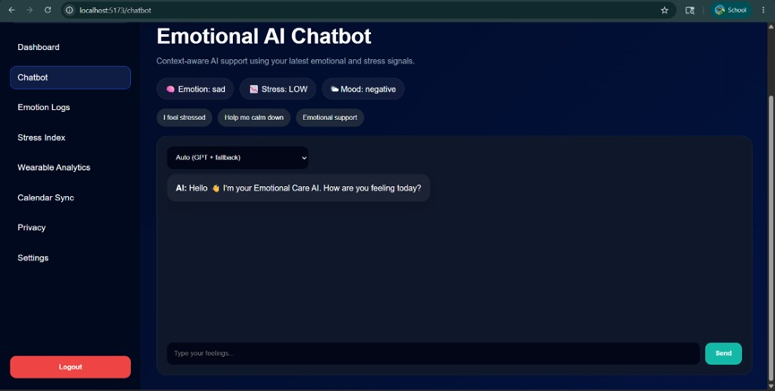
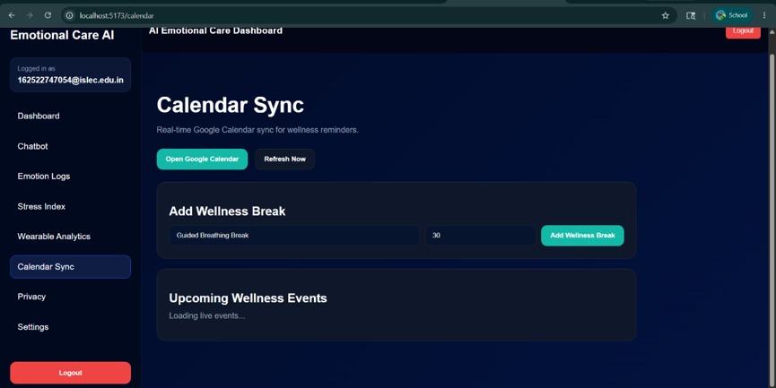
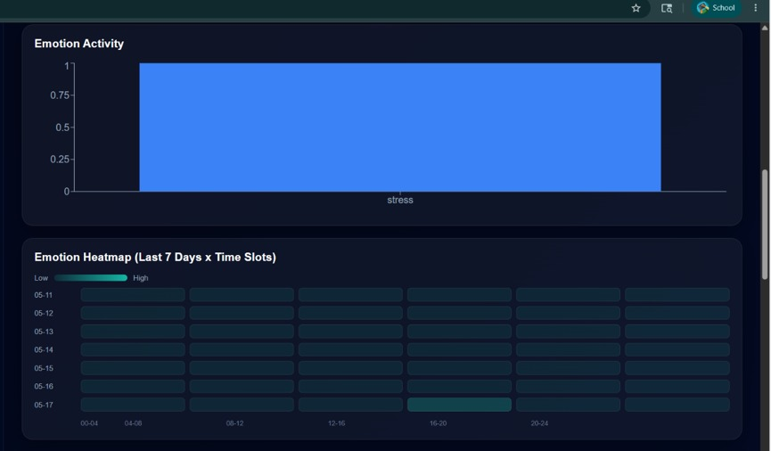

# Personalized Emotional Care Assistant

AI-powered emotional care platform that detects emotions through text, voice, and facial expressions while providing context-aware wellness recommendations.

## Features

- Text Sentiment Analysis
- Voice Emotion Recognition
- Facial Emotion Detection
- AI Chatbot Support
- Emotion Tracking Dashboard
- Wellness Recommendations
- Real-Time Analytics & Graphs

## Tech Stack

### Frontend
- React
- Vite
- Face API.js

### Backend
- FastAPI
- Python
- Transformers
- TensorFlow

### AI Models
- NLP Sentiment Analysis
- Voice Emotion Recognition
- Facial Emotion Detection

## Project Screenshots
## Project Screenshots

### Login Page

### Dashboard

### Face Detection

### Emotion Logs

### AI Chatbot

### Wellness Recommendations

### Analytics Graphs

